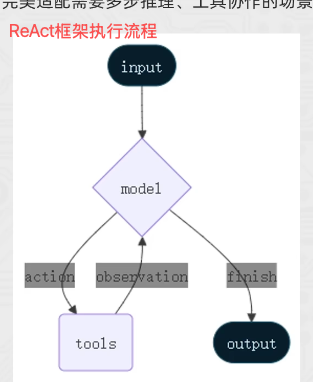
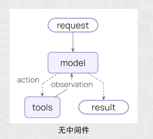
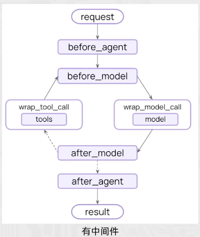

[TOC]

<br>

# 【1】智能体的ReAct模式

## 【1.1】ReAct介绍

1. <font color=red>ReAct：一种大模型智能体的核心思考与行动框架，全称 Reasoning + Acting（推理+行动），是让agent像人类一样 “思考问题 -> 制定策略 -> 执行行动 -> 验证结果” 的关键逻辑</font>； 
2. 简单来说， ReAct让agent不再是“直接回答问题”，而是通过“自然语言思考过程”指导工具调用，一步步解决复杂问题，完美适配需要多步推理，工具协作的场景（如智能客服，报告生成，任务规划等）
3. 一个典型的ReAct范式的Agent如图所示：
   1. <font color=red>思考Reasoning： 分析问题，判断现有信息是否足够，明确下一步</font>；
      1. 即模型决策是否需要调用外部工具获取更多信息来回答； 
   2. <font color=red>行动Action： 执行思考阶段指定的策略</font>；
      1. 即基于模型决策结果，调用工具获取信息；  
   3. <font color=red>观察Observation：获取行动的结果，提取有效信息</font>；
      1. 即获取工具返回值，判断工具是否正常工作，为下一轮思考提供信息；
   4. 总结：（再）思考 -> （再）行动 -> （再）观察 -> 循环往复直到结束 ； 



<br>

---

## 【1.2】langchain的ReAct框架

1. langchain的Agent对象遵循ReAct框架要求，在执行过程中会持续自我思考，自我行动，自我观察；

【代码实现】test0504_agent_react.py

```python
from langchain.agents import create_agent
from langchain_community.chat_models.tongyi import ChatTongyi
from langchain_core.tools import tool

# 获取股票价格工具或函数
@tool(description="获取体重，返回值是整数，单位千克")
def get_weight(name: str) -> str:
    return 90

# 获取股票信息
@tool(description="获取身高，返回值是整数，单位厘米")
def get_height(name: str) -> str:
    return 172

agent = create_agent(
    model=ChatTongyi(model="qwen3-max"),
    tools=[get_weight, get_height],  # 向智能体提供工具列表
    system_prompt="""你是严格遵循ReAct框架的智能体，必须按照[思考->行动->观察->再思考]的流程解决问题。
    且**每轮仅能思考并调用1个工具**，禁止单次调用多个工具。
    并告诉我你的思考过程，工具的调用原因。按思考、行动、观察三个结构告知我
    """
)

for chunk in agent.stream(
    {"messages":[{"role":"user", "content":"计算我的BMI"}]},
    stream_mode="values"
):
    latest_msg = chunk['messages'][-1]

    if latest_msg.content:
        print(type(latest_msg).__name__, latest_msg.content)

    try:
        if latest_msg.tool_calls:
            print(f"工具调用：{ [tc['name'] for tc in latest_msg.tool_calls] }")
    except AttributeError as e:
        pass

# HumanMessage 计算我的BMI
# AIMessage [思考]
# 要计算BMI（身体质量指数），需要知道用户的体重（千克）和身高（厘米）。公式为：
# $$ \text{BMI} = \frac{\text{体重（kg）}}{(\text{身高（m）})^2} $$
# 因此，首先需要获取用户的体重或身高。由于两个数据都未知，我先选择获取体重。
#
# [行动]
#
# 工具调用：['get_weight']
# ToolMessage 90
# AIMessage [观察]
# 获取到用户的体重为90千克。
#
# [思考]
# 现在已知体重为90千克，接下来需要获取用户的身高（厘米），以便计算BMI。因此，下一步调用获取身高的工具。
#
# [行动]
#
#
# 工具调用：['get_height']
# ToolMessage 172
# AIMessage [观察]
# 获取到用户的身高为172厘米。
#
# [思考]
# 现在已知体重为90千克，身高为172厘米。根据BMI公式：
# $$ \text{BMI} = \frac{90}{(1.72)^2} \approx 30.3 $$
# 计算得出用户的BMI约为30.3，属于肥胖范围（BMI ≥ 30）。
```

<br>

---


<br>

---

# 【2】Agent智能体中间件Middleware

## 【2.1】中间件Middleware

1. 中间件的作用：是对智能体的每一步工作进行控制和自定义执行；
   1. <font color=red>具体的，中间件是对智能体的每一步工作都加以拦截</font>； 

2. 作用场景：
   1. 日志记录，分析，调试；
   2. 转换提示词，工具选择； 
   3. 重试，备用，提前终止等逻辑控制； 
   4. 安全防护，个人身份检测等； 





3. langchain中内置了一些基础的中间件，参见： [https://docs.langchain.com/oss/python/langchain/middleware/overview](https://docs.langchain.com/oss/python/langchain/middleware/overview)
4. <font color=red>中间件通过hook钩子来实现拦截</font>，自定义中间件可以简单的使用装饰器来定义； 

5. <font color=red>节点式钩子（执行点顺序拦截）</font>：
   1. before_agent: agent执行前拦截； 
   2. after_agent： agent执行后拦截； 
   3. before_model： 模型执行前拦截； 
   4. after_model ： 模型执行后拦截； 
6. <font color=red>针对工具和模型的包装式钩子</font>： 
   1. wrap_model_call ： 每个模型调用时拦截；
   2. wrap_tool_call ： 每个工具调用时拦截；  

<br>

## 【2.2】中间件代码实现

【test0505_agent_middleware.py】

```python
from langchain.agents import create_agent, AgentState
from langchain.agents.middleware import before_agent, after_agent, before_model, after_model, wrap_model_call, \
    wrap_tool_call
from langchain_community.chat_models.tongyi import ChatTongyi
from langchain_core.tools import tool
from langgraph.runtime import Runtime


@tool(description="查询天气，传入城市名称字符串，返回字符串天气信息")
def get_weather(city: str) -> str:
    return f"{city}天气：晴天"


"""
1. agent执行前
2. agent执行后
3. model执行前
4. model执行后
5. 工具执行中
6. 模型执行中 
"""

@before_agent
def log_before_agent(state: AgentState, runtime: Runtime) -> None:
    # agent执行前会调用这个函数并传入state和runtime两个对象
    print(f"[before agent] agent启动，并附带{len(state['messages'])}条消息")
    for msg in state['messages']:
        print(type(msg).__name__, ": ", msg.content)

@after_agent
def log_after_agent(state: AgentState, runtime: Runtime) -> None:
    print(f"[after agent] agent结束，并附带{len(state['messages'])}条消息")
    for msg in state['messages']:
        print(type(msg).__name__, ": ", msg.content)

@before_model
def log_before_model(state: AgentState, runtime: Runtime) -> None:
    print(f"[before model] 模型即将调用，并附带{len(state['messages'])}条消息")
    for msg in state['messages']:
        print(type(msg).__name__, ": ", msg.content)

@after_model
def log_after_model(state: AgentState, runtime: Runtime) -> None:
    print(f"[after model] 模型调用结束，并附带{len(state['messages'])}条消息")
    for msg in state['messages']:
        print(type(msg).__name__, ": ", msg.content)

@wrap_model_call
def model_call_hook(request, handler):
    print("模型调用啦")
    return handler(request)

@wrap_tool_call
def monitor_tool(request, handler):
    print(f"工具执行：{request.tool_call['name']}")
    print(f"工具执行传入参数：{request.tool_call['args']}")

    return handler(request)

agent = create_agent(
    model=ChatTongyi(model="qwen3-max"),
    tools=[get_weather],  # 向智能体提供工具列表
    middleware=[log_before_agent, log_after_agent, log_before_model, log_after_model, model_call_hook, monitor_tool],
    system_prompt="""你是严格遵循ReAct框架的智能体，必须按照[思考->行动->观察->再思考]的流程解决问题。
    且**每轮仅能思考并调用1个工具**，禁止单次调用多个工具。
    并告诉我你的思考过程，工具的调用原因。按思考、行动、观察三个结构告知我
    """
)

result = agent.invoke({"messages":[{"role":"user", "content":"深圳今天的天气如何，如何穿衣"}]})
print("******************** 调用llm结果： ******************** \n")
for msg in result['messages']:
    print(type(msg).__name__, ": ", msg.content)
```

【打印结果】

```c++
[before agent] agent启动，并附带1条消息
HumanMessage :  深圳今天的天气如何，如何穿衣
[before model] 模型即将调用，并附带1条消息
HumanMessage :  深圳今天的天气如何，如何穿衣
模型调用啦
[after model] 模型调用结束，并附带2条消息
HumanMessage :  深圳今天的天气如何，如何穿衣
AIMessage :  **思考**：用户询问深圳今天的天气及穿衣建议。首先需要获取深圳的天气信息，才能进一步提供穿衣建议。因此，我需要调用`get_weather`工具查询深圳的天气。


工具执行：get_weather
工具执行传入参数：{'city': '深圳'}
[before model] 模型即将调用，并附带3条消息
HumanMessage :  深圳今天的天气如何，如何穿衣
AIMessage :  **思考**：用户询问深圳今天的天气及穿衣建议。首先需要获取深圳的天气信息，才能进一步提供穿衣建议。因此，我需要调用`get_weather`工具查询深圳的天气。


ToolMessage :  深圳天气：晴天
模型调用啦
[after model] 模型调用结束，并附带4条消息
HumanMessage :  深圳今天的天气如何，如何穿衣
AIMessage :  **思考**：用户询问深圳今天的天气及穿衣建议。首先需要获取深圳的天气信息，才能进一步提供穿衣建议。因此，我需要调用`get_weather`工具查询深圳的天气。


ToolMessage :  深圳天气：晴天
AIMessage :  **观察**：深圳今天的天气是晴天。

**思考**：根据晴天的天气情况，通常气温较高、阳光强烈，建议穿着轻薄透气的衣物，并注意防晒。例如短袖、短裤、裙子等，并可搭配太阳镜、遮阳帽和涂抹防晒霜。由于没有具体的温度数据，只能基于晴天的一般情况给出建议。
[after agent] agent结束，并附带4条消息
HumanMessage :  深圳今天的天气如何，如何穿衣
AIMessage :  **思考**：用户询问深圳今天的天气及穿衣建议。首先需要获取深圳的天气信息，才能进一步提供穿衣建议。因此，我需要调用`get_weather`工具查询深圳的天气。


ToolMessage :  深圳天气：晴天
AIMessage :  **观察**：深圳今天的天气是晴天。

**思考**：根据晴天的天气情况，通常气温较高、阳光强烈，建议穿着轻薄透气的衣物，并注意防晒。例如短袖、短裤、裙子等，并可搭配太阳镜、遮阳帽和涂抹防晒霜。由于没有具体的温度数据，只能基于晴天的一般情况给出建议。
******************** 调用llm结果： ******************** 

HumanMessage :  深圳今天的天气如何，如何穿衣
AIMessage :  **思考**：用户询问深圳今天的天气及穿衣建议。首先需要获取深圳的天气信息，才能进一步提供穿衣建议。因此，我需要调用`get_weather`工具查询深圳的天气。


ToolMessage :  深圳天气：晴天
AIMessage :  **观察**：深圳今天的天气是晴天。

**思考**：根据晴天的天气情况，通常气温较高、阳光强烈，建议穿着轻薄透气的衣物，并注意防晒。例如短袖、短裤、裙子等，并可搭配太阳镜、遮阳帽和涂抹防晒霜。由于没有具体的温度数据，只能基于晴天的一般情况给出建议。

```

<br>

---


