[TOC]

# 【README】

1. 本文总结自B站《agent skill ，从使用到原理，马克的技术工作坊》
2. 本文内容包括：
   1. skills 概念；
   2. 基本用法；
   3. 高级用法， 包括Reference， script； 
   4. 与mcp比较； 

<br>

---

# 【1】Agent Skill 概念

1. <font color=red>Agent Skill：是大模型可以随时翻阅的说明文档</font>；
   1. 【例】请将会议内容总结为如下几点：
      1. 参会人员；
      2. 议题；
      3. 决定；

<br>

---

# 【2】Agent Skill基本用法

## 【2.1】创建skill

1. 在用户目录文件夹，创建/.claude/skills 【<font color=red>注意是skills，而不是skill</font>】 
2. 创建文件夹，会议总结助手；

```shell
tom@TomMacbook %1~ %# mkdir skills
tom@TomMacbook %1~ %# cd skills
tom@TomMacbook %1~ %# mkdir meeting-summary
```

接着使用VS Code打开这个文件夹【meeting-summary】；

<br>

在【meeting-summary】文件夹中新建 SKILL.md文件，如下。

<font color=red>SKILL.md 文档结构</font>（分为两部分）：

1. 元数据（--- 与 ---之间的内容）：metadata；
   1. name: skill名称，必须与文件夹名字相同；
   2. description：skill描述，主要是用于向大模型说明这个skill的作用； 

2. 指令（# 会议总结助手到 输出）：Instruction；
   1. 详细描述模型需要遵循的规则； 


```markdown
---
name: meeting-summary
description: 该技能用于根据会议录音总结内容
---

# meeting-summary

## 总结规则

请将会议内容总结为以下几点：

- 参会人员
- 议题
- 决定

注意：每项都只能分别使用一句话来表述，不要分成多条。

## 示例

输入：

张三：那我们开始吧，今天主要是把下个月社区志愿活动的安排一次性定下来。
李四：我建议活动放在公园，人多也方便组织。
王五：可以，不过要提前申请场地，不然可能有风险。
赵六：场地申请我可以负责，这周内给大家结果。
孙七：人数最好先有个范围，方便准备物资。
张三：那就先按 50 人左右来估算吧。
李四：上次的手套还能用，但垃圾袋需要再买。
王五：预算要不要设个上限，避免超支。
张三：预算控制在 1000 以内，优先用现有物资。
孙七：时间我建议周六上午，天气也不会太热。
李四：九点集合应该比较合适。
赵六：我周三前把申请结果同步到群里。
张三：好，那报名截止时间定在周四晚上。
王五：周五可以统一分组和采购。
孙七：我来负责写报名文案和活动当天的合影安排。
张三：安全方面提醒大家带水，活动结束简单总结一下就行。
张三：那今天就到这，大家按分工推进吧。

输出：

- 参会人员：张三、李四、王五、赵六、孙七
- 议题：统一确定下个月社区志愿活动的地点、时间、人数、预算及分工安排。
- 决定：活动定在公园并于周六上午九点举行，按约 50 人规模和 1000 预算执行，由赵六负责场地申请、孙七负责宣传及合影，其余成员配合物资和分组。

```

【文档解说】

接着随便打开一个文件夹，打开claude code；

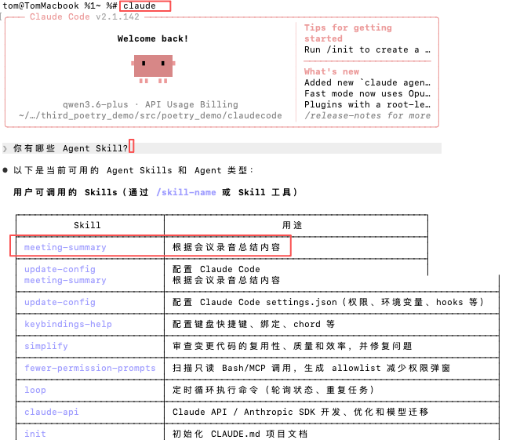

<br>

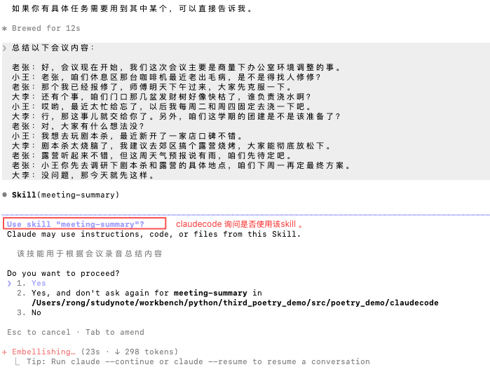

<br>

---

### 【2.1.1.】用户与CluadeCode与大模型交互时序图

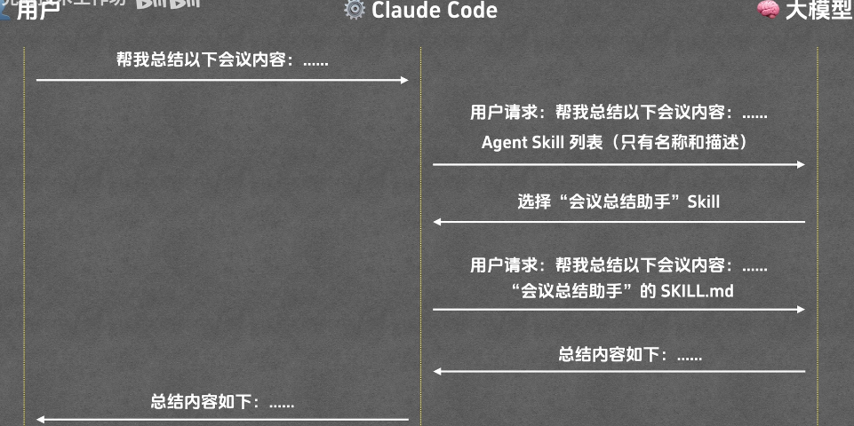

<br>

### 【2.1.2】skill的第一个核心机制-按需加载

1. agent skill的第1个核心机制：<font color=red>按需加载</font>；
   1. 虽然skill的名字和描述是始终对模型可见的；
   2. 但具体的指令内容，只有在这个skill被模型选中后，才会被加载进来给模型看；这就节省了很多token了；

<br>

---

## 【2.2】Agent Skill的高级用法（Reference篇）

1. 一开始，claude code 会把所有agent skill的名称和描述（元数据）都给到大模型； 比如会议总结skill，数据分析skill等；
   1. 接着，大模型会从中选择一个skill；
   2. 之后，只有被选中的那个skill的SKILL.md文件才会给到大模型；  （<font color=red>这就是按需加载；已经很省token了</font>）
2. 按需加载已经很省token了，但它还不够极致； 
3. <font color=red>比如我们的会议总结助手会越来越高级， 我们希望它不仅仅是简单复述，而是能够提供更有价值的补充说明</font>；
   1. 比如说，当会议决定要花钱时，它能够直接在总结里标注是否符合财务合规；
   2. 当涉及到合同时，它能够提示法务风险；这样大家在看会议总结的时候，就不再需要再去翻阅规章制度了；一眼就能够看到这些关键的补充信息； 
   3. <font color=red>但问题是</font>：skill能够做这些事情的前提是，它要把相关的财务规定和法律条文都写入到SKILL.md文件里；这些文件可能会非常长；<font color=red>都写入到 SKILL.md 的话，SKILL.md文件就会变得无比臃肿</font>；哪怕只是开个简单的早会，都要被迫加载一堆根本用不上的财务和法律废话，浪费模型资源；
   4. 问题总结： 那能不能做到按需中的按需呢？ 
      1. 比如说，只有当会议内容真的聊到了钱，claude code才会把财务规定加载给大模型看；
      2. <font color=red>Agent Skill 提供了Reference的概念，干的就是这个活</font>；

<br>

---

### 【2.2.1】Agent Skill的Reference实践

1. 在meeting-summary目录下新增一个reference文件，名称为 集团财务手册.md ；并修改SKILL.md的技能说明；

【集团财务手册.md】

```markdown
本手册详细规定了公司各部门在日常办公、差旅及商务活动中的支出限额与审批流程。

## 第一章：办公设备采购（IT Assets）

1. **更换周期**：笔记本电脑、显示器等固定资产的最低使用年限为 3 年。
2. **采购权限**：
   - 标准办公电脑：单价不得超过 10,000 元。
   - 高性能工作站：单价 10,000 - 20,000 元，需部门总监（Director）审批。
   - 特殊定制设备：单价超过 20,000 元，必须由 IT 总监特批，并提交 CFO 最终签字。
3. **招标要求**：单笔采购总额超过 50,000 元时，必须启动至少三方参与的公开招标流程。

## 第二章：国内差旅标准（Domestic Travel）
1. **住宿补贴（按城市等级）**：
   - 一线城市（北京、上海、广州、深圳）：800 元/晚。
   - 新一线及二线城市：500 元/晚。
   - 其他城市：350 元/晚。
2. **交通工具**：
   - 飞行时长 4 小时以内仅限经济舱。
   - 高铁限二等座（部门副总及以上级别可选一等座）。

## 第三章：商务招待与餐饮（Entertainment）
1. **招待标准**：
   - 商务正餐：人均限额 300 元。若超过 300 元/人（如上海、香港等高消费地区最高可至 500 元/人），需附完整参会名单并提交业务副总裁（VP）特批。
2. **陪访要求**：内部陪同人员人数不得超过外部客户人数。


## 第四章：日常零星报销
1. **自主额度**：单笔 500 元以下的办公杂费支出可由员工自主报销。
2. **主管审批**：500 元至 5,000 元的支出由部门直接主管在系统内审批。

## 第五章：市场活动与公关
1. **预算申报**：所涉及品牌推广、市场活动的预算需提前 14 天提交 OA 流程申报。
2. **礼品采购**：单份赠礼价值上限为 300 元。

---
*注：以上所有金额单位均为人民币（CNY）。违反以上限额且未获得特批的申请，财务部将予以退回。*

```

【SKILL.md】新增财务提醒规则，如下。

```markdown
请将会议内容总结为以下几点：

- 参会人员
- 议题
- 决定
- 财务提醒：仅在提到“钱、预算、采购、费用”时触发。需要读取`集团财务手册.md`，指出决定中的金额是否超标，并明确审批人。
```

<br>

2. 请求claude code总结会议内容：

```shell
总结以下会议的内容：

老陈：小李，下周二你跟我去趟上海，咱们得把那个大客户签下来。
小李：没问题陈总，那我今天先把出差申请给报了。
老陈：行，酒店你看看订，要方便出行的，外滩那边有个酒店不错，大概 1200 一晚。
小李：1200 稍微有点贵，但我看那地段确实好，那我就按这个金额报了？
老陈：报吧。另外晚上咱们得请客户吃顿饭，规格得高一点。
小李：明白，我预订个 3000 块左右的包间，咱们一共 6 个人，这标准行吗？
老陈：行，人均 500 在上海这种地方也算正常，为了签单这钱该花。
小李：好，那我申请单里的住宿填 1200，餐饮填 3000，我待会直接提交系统。
老陈：可以，你动作快点，审批完了咱们好赶紧订票。
老陈：没别的事就先去忙吧。

```

【补充】claude code响应：

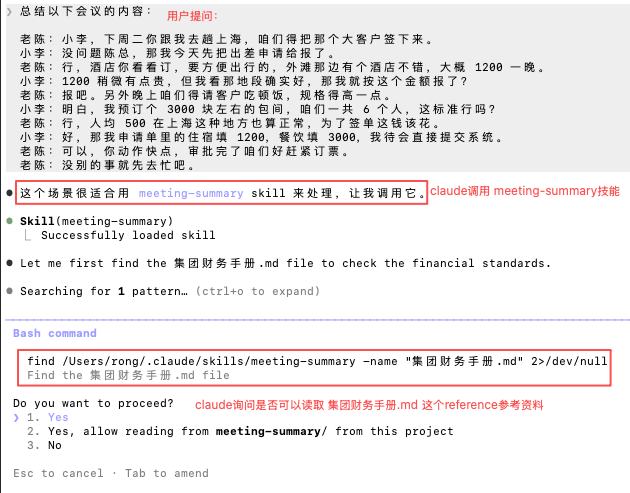

<br>

claude请求读取<font color=red>集团财务手册.md这个reference参考资料</font>。

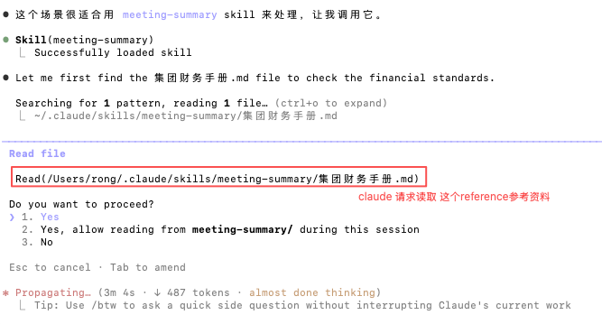

<br>

【claude生成的会议总结】

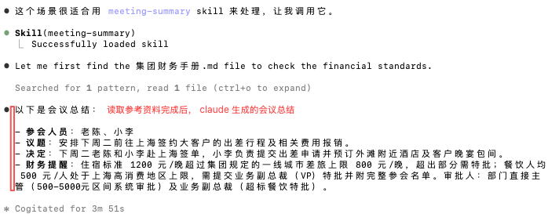

---

### 【2.2.2】Agent Skill的Reference的触发特性（条件触发）

1. <font color=red>skill的reference触发特性： 条件触发</font>；
   1. 在上述会议总结例子中，只有当claude code读取完SKILL.md文件后，判断出需要查账时才会去加载集团财务手册.md这个文件；
   2. 反过来说：如果这是一个与钱无关的技术复盘会，那么这个财务文件就只会躺在硬盘里；绝不会占用哪怕一个token的上下文； 

<br>

---

## 【2.3】Agent Skill的高级用法（Script篇）

1. <font color=red>skill查资料只是第一步，能够直接动手运行代码帮程序员把活干了才是真正自动化</font>；
2. 这就用到了Agent Skill的另一大能力 script；

<br>

---

### 【2.3.1】agent skill的script实践

1. 在 meeting-summary目录下创建一个python脚本，名称为upload.py ，用于上传文件；

【upload.py】

```python
import sys
import time

def upload_summary(content):
    print("\n[System] 启动上传程序...")
    time.sleep(0.5)

    print("[System] 正在连接公司内部服务器 (https://api.internal.wiki)...")
    time.sleep(1.2)

    # 模拟数据处理
    print(f"[System] 正在上传总结内容（字符数：{len(content)}）...")
    time.sleep(1.0)

    print("--------------------------------------------------")
    print("✅ 上传成功！")
    print(f"📄 文档已保存至：/meetings/2024/summary_{int(time.time())}.md")
    print("🔗 预览链接：https://wiki.internal.com/view/99281")
    print("--------------------------------------------------")

if __name__ == "__main__":
    # 获取 Claude 传入的总结文本
    if len(sys.argv) > 1:
        summary_text = sys.argv[1]
        upload_summary(summary_text)
    else:
        print("X 错误：未接收到总结内容。")
```

2. 修改 SKILL.md中，再加上一段关于文件上传规则的描述；如下；

````markdown
## 上传规则

如果用户提到“上传”、“同步”或“发送到服务器”，你必须运行 `upload.py` 脚本将总结内容上传到服务器。脚本使用方法：

```python
python upload.py "会议总结内容"
```
````

3. 进入claude code 输入请求：

```shell
使用meeting-summary技能，总结以下会议的内容，并上传到服务器中：

老张：好，会议现在开始，我们这次会议主要是商量下办公室环境调整的事。
小王：老张，咱们休息区那台咖啡机最近老出毛病，是不是得找人修修？
老张：那个我已经报修了，师傅明天下午过来，大家先克服一下。
大李：还有个事，咱们门口那几盆发财树好像快枯了，谁负责浇水啊？
小王：哎哟，最近太忙给忘了，以后我每周一和周四固定去浇一下吧。
大李：行，那这事儿就交给你了。另外，咱们这学期的团建是不是该准备了？
老张：对，大家有什么想法吗？
小王：我想去玩剧本杀，最近新开了一家店口碑不错。
大李：剧本杀太烧脑了，我建议去郊区搞个露营烧烤，大家能彻底放松下。
老张：露营听起来不错，但这周天气预报说有雨，咱们先待定吧。
老张：小王你先去调研下剧本杀和露营的具体地点，咱们下周一再定最终方案。
大李：没问题，那今天就先这样。
```

<br>

【补充】claude code 响应如下：

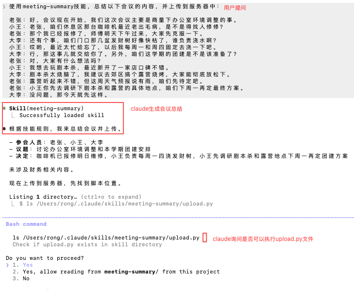

<br>

claude 再次询问是否可以授权它上传文件；

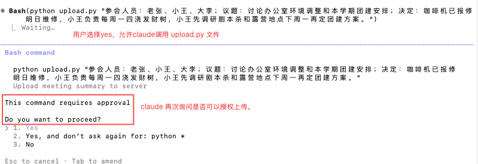

claude上传文件完成。

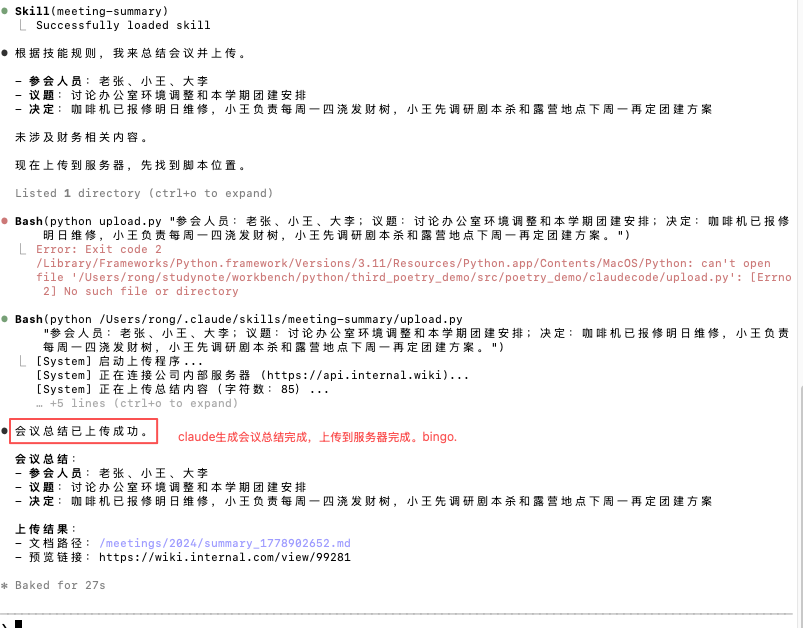

<br>

【效果解说】

1. claude code 申请执行这个 upload.py 文件；它并没有去读取这个文件；
   1. <font color=red>因为，Agent Skill里面的代码只会被执行，不会被读取</font>； 
   2. 这就意味着，哪怕你的脚本写了一万行复杂的业务逻辑，它消耗的模型上下文几乎是零； 
   3. Claude code：只关心脚本的运行方法和运行结果；至于这个脚本的内容，它毫不关心； 
2. <font color=red>结论：虽然reference 与 script都属于Agent Skill的高级功能，但是它们对于模型上下文的影响其实是截然不同的</font>；
   1. reference是读： 他会把内容加载到上下文里面，所以是会消耗token的；
   2. script是跑或执行：它只会被执行，不会占用模型的上下文； 

 <br>

---

## 【2.4】Agent Skill的渐进式披露机制

1. <font color=red>Agent Skill：是一个精密的渐进式披露结构； 该结构一共有三层</font>；
   1. 第1层：元数据层-metadata； 包含所有的Agent Skill的名称和描述； <font color=red>属于始终加载</font>；
      1. 相当于大模型里面的目录；大模型每次回答前都会看以下这一层的信息； 然后决定用户的问题是否与某个Agent Skill相匹配；
   2. 第2层：指令层-instruction；对于SKILL.md文件里面，除了名称和描述之外其余的部分；
      1. 只有当大模型发现用户的问题，与某个Agent Skill相匹配的时候，它才会去加载这一层的内容； <font color=red>属于按需加载</font>；
   3. 第3层：资源层-resources；包含 Reference和Script两方面的内容；<font color=red>属于按需中的按需加载</font>；
      1. 按照官方最新的规范，应该还有一个组成部分叫做Asset；它与Reference的定义有部分重叠，因此本文暂且忽略它；
         1. 如：meeting-summary这个技能中的集团财务手册和upload.py 脚本就属于这一层； 
         2. 只有当模型发现用户问题与财务或上传相关的时候，才会去加载这一层的内容； 
            1. <font color=red>这就相当于是在按需加载的指令层基础上，又做了一次按需加载；所以我们可以称它为按需中的按需加载</font>；
      2. <font color=red>Reference与Script的加载方式不同</font>：
         1. Reference：是被读取的；claude code会把对应文件的内容作为上下文送给大模型，以供模型回答时参考；
         2. Script：是被执行的；claude code根本就不会去看代码的内容，它只关心代码的执行结果 ；
            1. 当然这也不是铁律；如果你没有把代码的执行方法说清楚，claude code还是有可能去通过看代码，这样的话，就会占用模型的上下文token了；
            2. 所以：还是请大家写Skill的时候，尽可能把一切都解释清楚； 

<br>

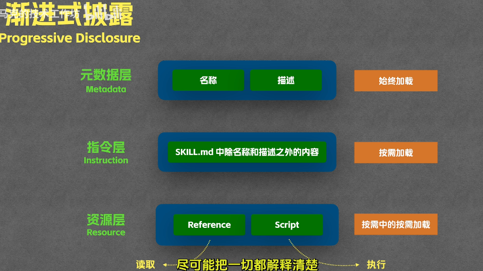

<br>

---

# 【3】Agent Skill与MCP对比 

1. 参见： [https://claude.com/blog/skills-explained](https://claude.com/blog/skills-explained)
2. 有同学可能有这种感觉：Agent Skill好像与MCP有点像； 本质上都是让模型去连接和操作外部世界；既然功能重叠，那我们到底应该使用哪一个？
3. <font color=red>Anthropic官网说明了Agent Skill与MCP的区别</font>：MCP给大模型供给数据（如查询昨天的销售记录），而Skill是教会大模型如何处理这些数据（如会议总结必须要有个议题，汇报文档必须包含具体数据等）；

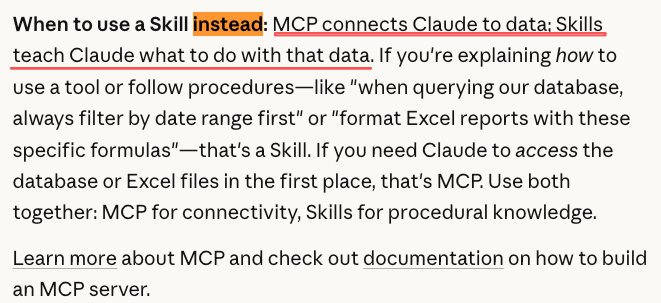

<br>

---

## 【3.1】关于Agent Skill与MCP的不同适用场景

1. 有些同学：可能会问了；不对啊，Agent Skill里面也能写代码；<font color=red>我直接在Agent Skill里面写连接数据的逻辑不就可以了吗； 这样就不需要MCP了；Agent Skill就直接把两个活都给干了</font>； 
2. 确实，Agent Skill也能连接数据；功能上与MCP有所重叠；<font color=red>但是能干并不代表适合干；这就好像瑞士军刀也能切菜，但没有人会这么干</font>；
3. <font color=red>MCP本质上是一个独立运行的程序，而Agent Skill本质上是一段说明文档</font>；它们的本质不同，决定了适合的场景也是不同的；
   1. Agent Skill：更适合跑一些轻量脚本，处理简单的逻辑；<font color=red>在代码执行方面，Agent Skill的安全性和稳定性都不及 MCP </font>；所以大家还是要根据场景选择合适的工具；
      1. 甚至在很多的场景下，我们需要把Agent Skill 与 MCP结合起来一起使用，以便尽可能地满足我们的需求；

<br>

---


